# Linear Regression
##1.线性回归模型
一般情况下，线性回归模型假设函数为：
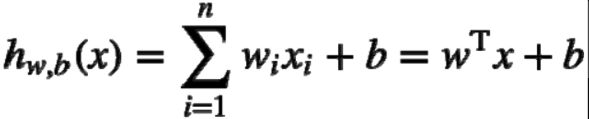

其中，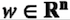与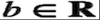为模型参数，也称为回归系数。

为了方便，通常将b纳入权向量w，作为w0，同时为输入向量x添加一个常数1作为x0:
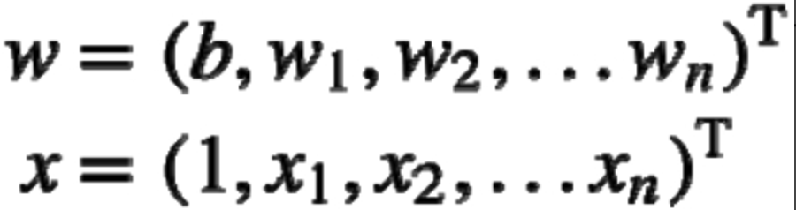

假设函数可以修改为如下：
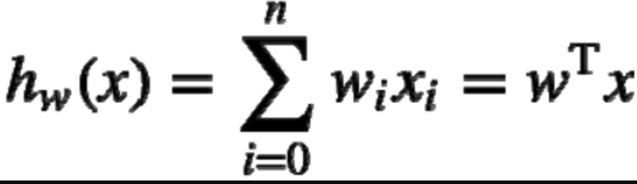

其中，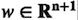，通过训练确定模型参数w后，便可使用模型对新的输入实例进行预测

##2.最小二乘法
线性回归模型通常使用均方误差（MSE）作为损失函数，假设训练集D有m个样本，均方误差损失函数定义为:
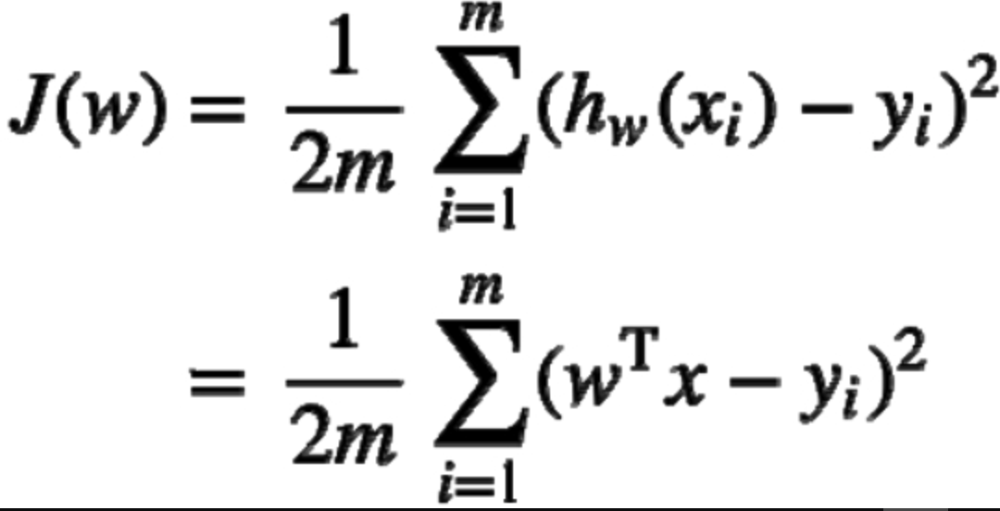

均方误差的含义很容易理解，即所有实例预测值与实际值误差平方的均值，模型的训练目标是找到使得损失函数最小化的w。

式中的常数1/2并没有什么特殊的数学含义，仅是为了优化时求导方便。

损失函数J(w)最小值点是其极值点，可先求J(w)对w的梯度并令其为0，再通过解方程求得。

计算J(w)的梯度：
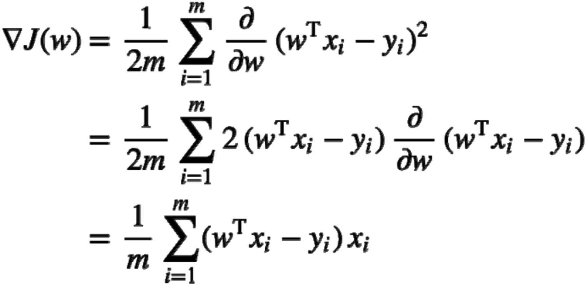

以上公式使用矩阵运算描述形式更为简洁，设：
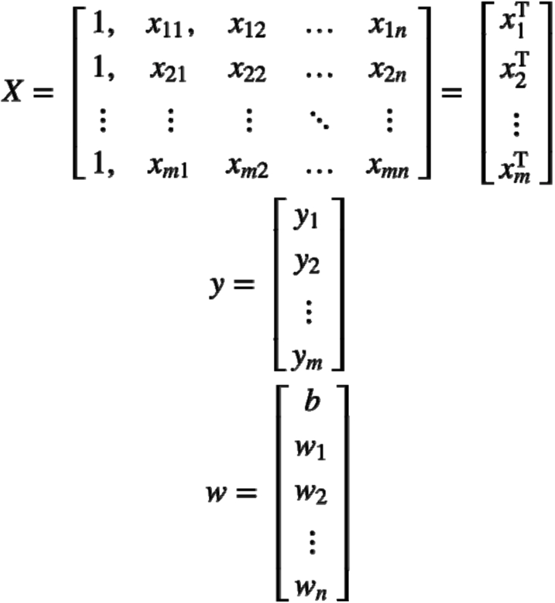

那么，梯度计算公式可写为：
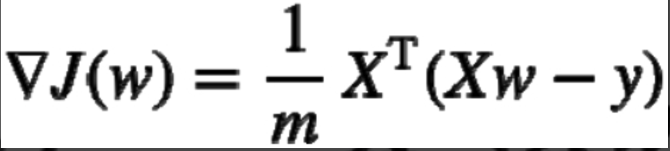

令梯度为0，解得：
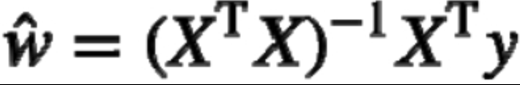

式中，w^即为使得损失函数（均方误差）最小的w。

需要注意的是，式中对XTX求了逆矩阵，这要求XTX是满秩的;然而实际应用中，XTX不总是满秩的（例如特征数大于样本数），此时可解出多个w^，选择哪一个由学习算法的归纳偏好决定，常见做法是引入正则化项。

以上求解最优w的方法被称为普通最小二乘法（Ordinary LeastSquares，OLS）。
##3.梯度下降

