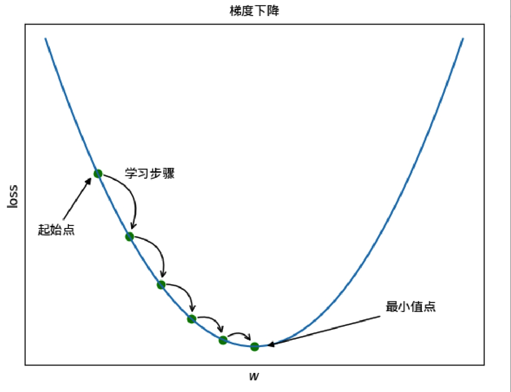
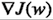
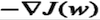
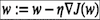
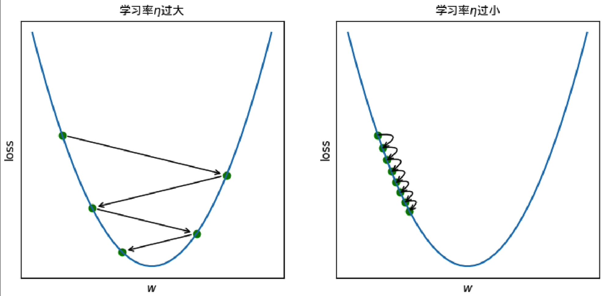
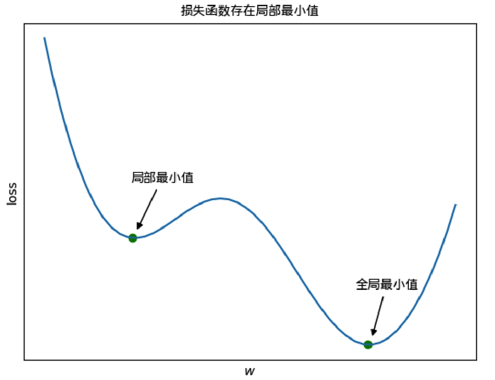
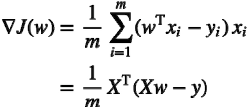
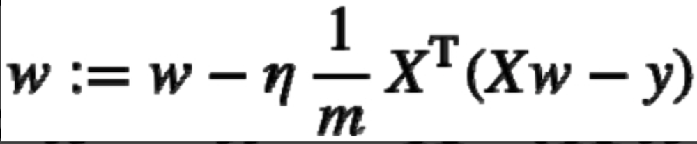

# Linear Regression
##1.线性回归模型
一般情况下，线性回归模型假设函数为：

其中，与为模型参数，也称为回归系数。

为了方便，通常将b纳入权向量w，作为w0，同时为输入向量x添加一个常数1作为x0:

假设函数可以修改为如下：

其中，，通过训练确定模型参数w后，便可使用模型对新的输入实例进行预测

##2.最小二乘法
线性回归模型通常使用均方误差（MSE）作为损失函数，假设训练集D有m个样本，均方误差损失函数定义为:

均方误差的含义很容易理解，即所有实例预测值与实际值误差平方的均值，模型的训练目标是找到使得损失函数最小化的w。

式中的常数1/2并没有什么特殊的数学含义，仅是为了优化时求导方便。

损失函数J(w)最小值点是其极值点，可先求J(w)对w的梯度并令其为0，再通过解方程求得。

计算J(w)的梯度：

以上公式使用矩阵运算描述形式更为简洁，设：

那么，梯度计算公式可写为：

令梯度为0，解得：

式中，w^即为使得损失函数（均方误差）最小的w。

需要注意的是，式中对XTX求了逆矩阵，这要求XTX是满秩的;然而实际应用中，XTX不总是满秩的（例如特征数大于样本数），此时可解出多个w^，选择哪一个由学习算法的归纳偏好决定，常见做法是引入正则化项。

以上求解最优w的方法被称为普通最小二乘法（Ordinary LeastSquares，OLS）。

##3.梯度下降
###3.1.梯度下降算法
有很多机器学习模型的最优化参数不能像普通最小二乘法那样通过“闭式”方程直接计算，此时需要求助于迭代优化方法。

通俗地讲，迭代优化方法就是每次根据当前情况做出一点点微调，反复迭代调整，直到达到或接近最优时停止，应用最为广泛的迭代优化方法是梯度下降（Gradient Descent）。

下图所示为梯度下降算法逐步调整参数，从而使损失函数最小化的过程示意图：

梯度下降算法常被形象地比喻为“下山”,如果你想尽快走下一座山，那么每迈一步的方向应选择当前山坡最陡峭的方向，迈一步调整一下方向，一直走到发现脚下已是平地。

对于函数而言，梯度向量的反方向是其函数值下降最快的方向，即最陡峭的方向。

梯度下降算法可描述为：

（1）根据当前参数w计算损失函数梯度。

（2）沿着梯度反方向调整w，调整的大小称为步长，由学习率n控制。使用公式表述为：

（3）反复执行上述过程，直到梯度为0或损失函数降低小于阈值，此时称算法已收敛。

应用梯度下降算法时，超参数学习率n的选择十分重要。

如果n过大，则有可能出现走到接近山谷的地方又一大步迈到了山另一边的山坡上，即越过了最小值点；如果n过小，下山的速度就会很慢，需要算法更多次的迭代才能收敛，这会导致训练时间过长。

以上两种情形如图所示:

另外，还需知道的是，上图中的损失函数对于梯度下降算法是很理想的，它仅有一个全局最小值点，算法最终将收敛于该点。

但也有很多机器学习模型的损失函数存在局部最小值，其曲线如绵延起伏的山脉，如下图所示：

对于图中的损失函数，假设梯度下降算法的起始点位于局部最小值点左侧，算法则有可能收敛于局部最小值，而非全局最小值。

此例子表明，梯度下降算法并不总收敛于全局最小值。

上一节中，我们计算出线性回归损失函数的梯度为：

设学习率为n，梯度下降算法的参数更新公式为：

可以看出，执行梯度下降算法的每一步都是基于整个训练集X计算梯度的，因此梯度下降也被称为批量梯度下降：每次使用整批训练样本计算梯度，在训练集非常大时，批量梯度下降算法会运行得极慢。

下一小节将介绍的随机梯度下降和小批量梯度下降可以解决该问题。